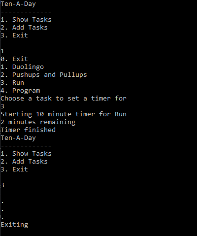

#Ten a Day

## Command Line App for setting short 10 minute timers for tasks

### Ideally used for tasks that you want to get a minimal amount of time in per day

### Run `g++ tenaday.cpp` then run the exe file

# Screenshots

## Todo

[x] Add timer
[x] Use vectors for tasks to more easily refer to tasks
[ ] Add a way to check off tasks completed
